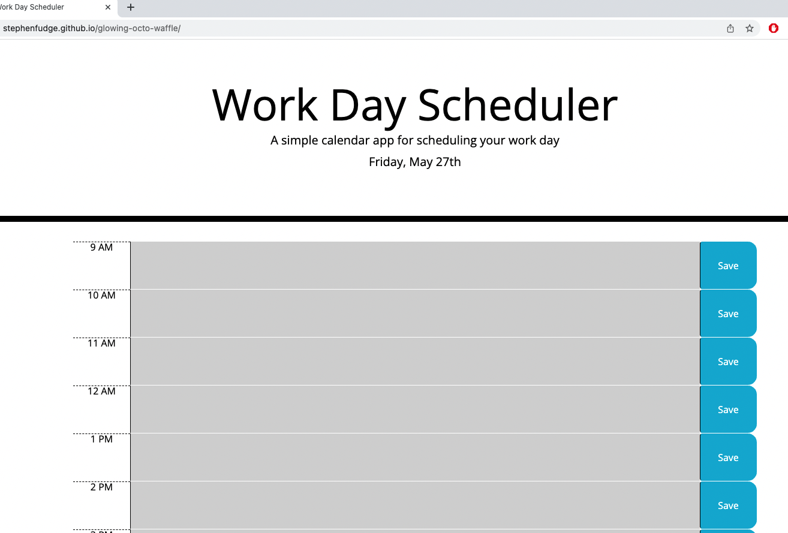

# glowing-octo-waffle

## 9-5 Day Planner - Challenge Assignment 5 Third Party APIs

- *What was your motivation?*  I wanted to create a single day planner
- *Why did you build this project?*  To show people projects that I have been involved in creating.
- *What problem does it solve?*  It solves me having to write everything down on paper
- *What did I learn?* I learned about bootstrap premade classes and jQuery shorthands. I also learned about using moment.js for the date/time. 

## Installation

*What are the steps required to install your project? Provide a step-by-step description of how to get the development environment running.*

Go to https://stephenfudge.github.io/glowing-octo-waffle/ and the page should load and function properly. 

Alternatively, if you wish to download the files then you shoud do the following:
Download the index.html file as well as the assets folder and the project should work and function properly. 

## Usage

*Provide instructions and examples for use. Include screenshots as needed.*

Upon loading the page, you should be greeted by the Work Day Scheduler providing today's date. There is an hour time block for every hour between 9am and 5pm. 

The hour blocks will change colour based on what time of day it is.  If an hour has passed the block will be grey, if it is currently that time it will be red, and if it is still to come it will be green. 

Below is a screenshot of what the site should look like upon entry. There is one additional screenshot in the images folder as well.

## Credits
I used getbootsrap.com for help with the classes and momentjs.com for help with how to call and print the date/time.